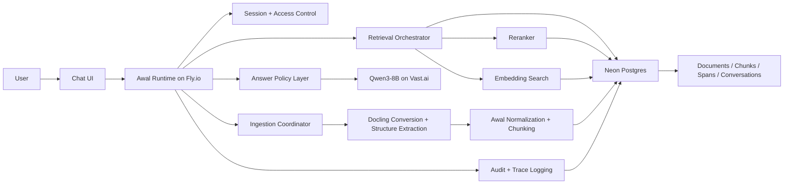

# Awal Architecture

## Purpose

Awal is a document-bounded chatbot. It should answer questions only from documents that have been deliberately provided to the system and successfully ingested.

The system must:

- answer from retrieved evidence only
- return citations for grounded answers
- refuse when evidence is weak or absent
- surface conflicts when documents disagree
- preserve exact provenance down to concrete chunk and span references

The system must not:

- answer from general world knowledge
- silently fill gaps with plausible language
- hide retrieval uncertainty
- mix documents across security boundaries

## Product scope

The initial version is intentionally narrow:

- document upload and ingestion
- document-scoped chat
- evidence retrieval and reranking
- citation-bearing answers
- refusal on insufficient evidence
- standard chat UI

The initial version does not require:

- general web search
- external tool use by the model
- autonomous planning across multiple product surfaces
- complex multi-agent orchestration

## Core principles

- `documents are the only truth source`
- `retrieval precedes generation`
- `evidence precedes trust`
- `no silent downgrades`
- `policy precedes side effects`
- `the model is not the governor`

## Architectural layers

### 1. Client layer

This includes:

- standard web chat UI
- admin upload surface
- optional MCP client integration later

Responsibilities:

- send user questions
- display grounded answers
- display citations and refusal states
- show uploaded document state

### 2. Runtime kernel

This is the main Awal backend running on Fly.io.

Responsibilities:

- session creation and validation
- document access control
- query normalization
- retrieval orchestration
- evidence-threshold checks
- answer prompt construction
- refusal and conflict policy
- audit logging
- response normalization

This layer is the governor. It is where the main control logic belongs.

### 3. Retrieval layer

Responsibilities:

- lexical retrieval
- vector retrieval
- hybrid fusion
- reranking
- candidate evidence selection
- chunk and span lookup

The retrieval layer should select evidence, not write answers.

### 4. Model serving layer

This runs on Vast.ai.

Responsibilities:

- generate answers from provided evidence
- optionally produce structured outputs
- remain bounded by runtime-supplied evidence

This layer must not decide:

- what corpus is allowed
- whether evidence is sufficient
- whether unsupported claims are acceptable

### 5. Storage and artifact layer

This runs primarily on Neon and object storage.

Responsibilities:

- store document identities
- preserve chunk and citation spans
- record retrieval traces
- record answer decisions
- track revision history

## Runtime responsibility split

The design intentionally mirrors the wider portfolio's best boundaries:

- `Y-MIR style responsibility`
  - public contract
  - session/runtime surface
  - request normalization
- `Lucadra style responsibility`
  - truth-source logic
  - exact retrieval and evidence handling
  - citation-bearing responses
- `Nomos style responsibility`
  - refusal rules
  - policy checks
  - trust labeling
- `Inari style responsibility`
  - document parsing
  - artifact structure
  - revision-aware ingest and validation

## Answer states

Every answer should be emitted as one of a small number of explicit states.

- `grounded_answer`
  - sufficient evidence found
  - answer generated from retrieved material
  - citations present
- `insufficient_evidence`
  - retrieval found too little support
  - system refuses to answer substantively
- `conflict_detected`
  - documents disagree materially
  - system presents conflict rather than merging unsupported claims
- `ingestion_pending`
  - the referenced document set is not yet ready

These are not UI labels only. They are runtime-level result types.

## Security and scope model

Awal should support document isolation from the start.

At minimum, every access path should be scoped by:

- `workspace_id`
- `collection_id`
- `document_id`
- `user_id` or `session_id`

The runtime should never retrieve outside the permitted workspace and collection boundary.

## Why this design fits the problem

Awal is not a broad assistant problem. It is a governed retrieval-and-answer problem.

That means the most important system qualities are:

- correct retrieval
- correct refusal
- exact provenance
- stable policy enforcement

Not:

- maximum autonomous reasoning depth
- broad tool use
- open-ended general intelligence

## High-level architecture

