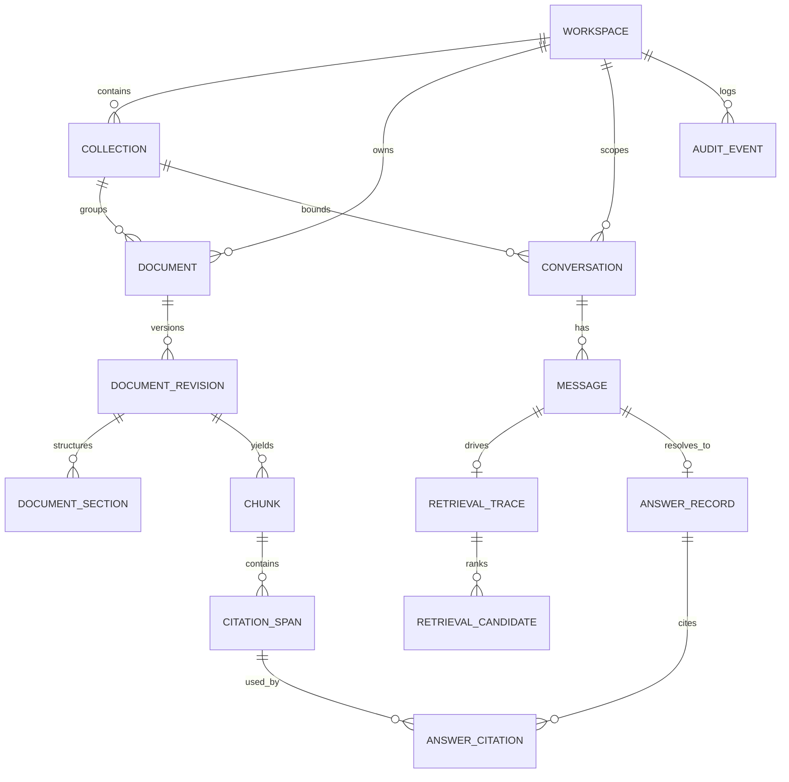

# Data Model

## Purpose

This document defines the logical data model for Awal.

The design centers on:

- workspace-bounded documents
- revision-aware ingestion
- exact chunk and span provenance
- explicit retrieval traces
- explicit answer states

## Main entities

### Workspace

Top-level ownership boundary for data and access control.

Fields:

- `id`
- `name`
- `slug`
- `created_at`
- `updated_at`

### Collection

Logical grouping of documents used together in chat.

Fields:

- `id`
- `workspace_id`
- `name`
- `description`
- `visibility`
- `created_at`
- `updated_at`

### Document

Stable identity for a document across revisions.

Fields:

- `id`
- `workspace_id`
- `collection_id`
- `title`
- `source_kind`
- `mime_type`
- `status`
- `latest_revision_id`
- `created_at`
- `updated_at`

### DocumentRevision

Revision-aware ingest record for a document.

Fields:

- `id`
- `document_id`
- `storage_uri`
- `checksum`
- `file_size_bytes`
- `ingestion_status`
- `extracted_text_status`
- `chunking_status`
- `embedding_status`
- `created_at`

### DocumentSection

Optional structural representation for headings/sections.

Fields:

- `id`
- `document_revision_id`
- `parent_section_id`
- `section_path`
- `heading`
- `ordinal`

### Chunk

Primary retrieval unit.

Fields:

- `id`
- `document_revision_id`
- `section_id`
- `chunk_index`
- `text`
- `token_count`
- `char_count`
- `page_start`
- `page_end`
- `line_start`
- `line_end`
- `embedding_vector`
- `search_text`

### CitationSpan

Exact answer-supporting span inside a chunk.

Fields:

- `id`
- `chunk_id`
- `start_char`
- `end_char`
- `quoted_text`
- `page_start`
- `page_end`
- `line_start`
- `line_end`

### Conversation

Chat thread scoped to a workspace and collection.

Fields:

- `id`
- `workspace_id`
- `collection_id`
- `title`
- `status`
- `created_at`
- `updated_at`

### Message

User or assistant message inside a conversation.

Fields:

- `id`
- `conversation_id`
- `role`
- `content`
- `created_at`

### RetrievalTrace

Stored record of how evidence was selected.

Fields:

- `id`
- `conversation_id`
- `message_id`
- `query_text`
- `retrieval_mode`
- `threshold_passed`
- `created_at`

### RetrievalCandidate

Ranked candidate evidence row for a specific trace.

Fields:

- `id`
- `retrieval_trace_id`
- `chunk_id`
- `dense_score`
- `lexical_score`
- `hybrid_score`
- `rerank_score`
- `final_rank`
- `selected`

### AnswerRecord

Normalized answer decision produced by the runtime.

Fields:

- `id`
- `conversation_id`
- `message_id`
- `state`
- `model_name`
- `prompt_token_count`
- `completion_token_count`
- `refusal_reason`
- `created_at`

### AnswerCitation

Join table between answers and the concrete evidence used.

Fields:

- `id`
- `answer_record_id`
- `citation_span_id`
- `citation_order`

### AuditEvent

Operational and policy event log.

Fields:

- `id`
- `workspace_id`
- `event_type`
- `entity_type`
- `entity_id`
- `payload_json`
- `created_at`

## Key relationships

- one workspace has many collections
- one collection has many documents
- one document has many revisions
- one revision has many chunks
- one chunk has many citation spans
- one conversation belongs to one workspace and one collection
- one message belongs to one conversation
- one retrieval trace belongs to one message
- one answer record belongs to one assistant message
- one answer record has many answer citations

## ERD

## Initial table priorities

The first migration set should prioritize:

- `workspaces`
- `collections`
- `documents`
- `document_revisions`
- `chunks`
- `citation_spans`
- `conversations`
- `messages`
- `retrieval_traces`
- `retrieval_candidates`
- `answer_records`
- `answer_citations`
- `audit_events`

## Important design rules

- `document_id` is stable, `document_revision_id` is version-specific
- chunks should point to a specific revision, not the abstract document
- answers should cite spans, not only documents
- retrieval traces should be saved so failures can be debugged
- the system should be able to re-run ingest without corrupting prior history
