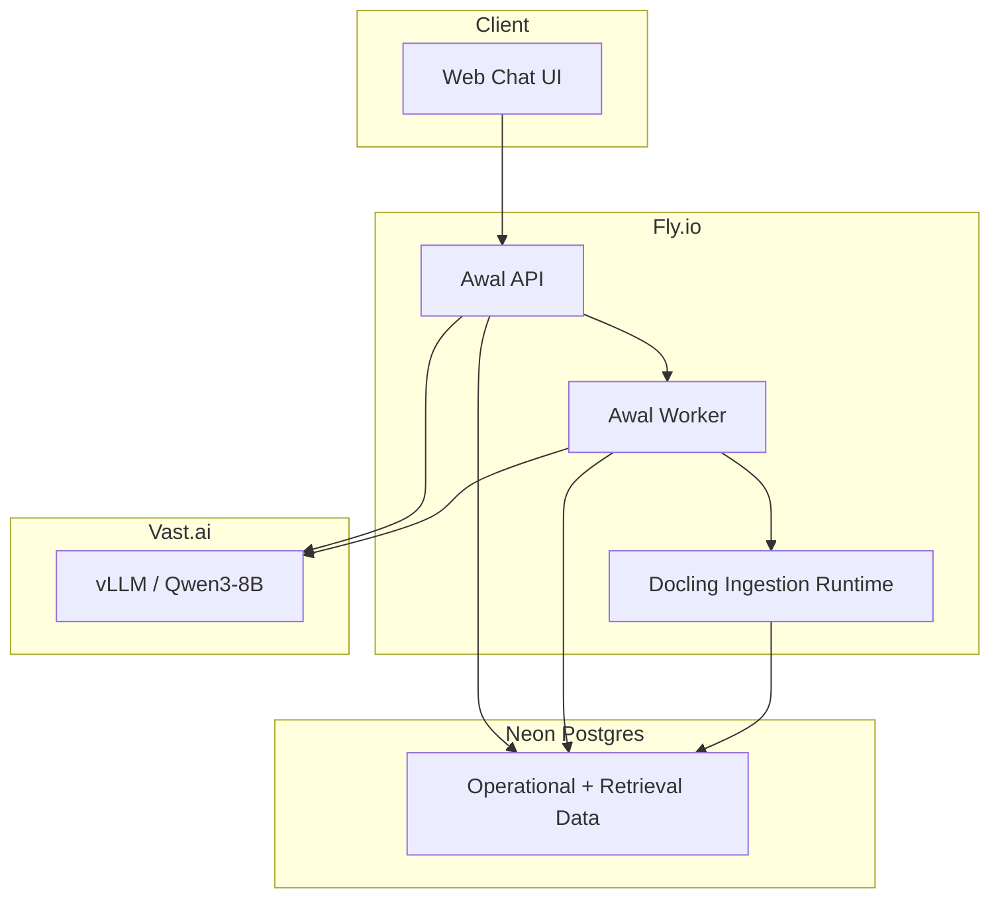

# Deployment Topology

## Purpose

This document defines how Awal should be deployed across Fly.io, Neon, and Vast.ai.

## Environment split

### Fly.io

Fly.io should host the product-facing control plane.

Services:

- public API
- session/auth service
- ingestion coordinator
- retrieval orchestrator
- policy layer
- MCP surface, if exposed
- optional async worker

Why Fly.io:

- stable web/API runtime
- simple deployment topology
- good fit for stateless application services
- clean secret and app deployment model

### Neon

Neon should be the durable system-of-record for structured Awal state.

Use Neon for:

- workspaces
- collections
- documents
- document revisions
- chunks
- citation spans
- retrieval traces
- conversations
- answer records
- audit events

### Vast.ai

Vast.ai should host the model-serving plane.

Use Vast.ai for:

- `vLLM` server for `Qwen3-8B`
- optional embeddings service if moved off Fly
- optional reranker service if traffic grows

Why Vast.ai:

- cheap GPU experimentation
- easy upgrade path from 16 GB to larger cards
- fits the "own the model runtime" requirement

## Recommended initial topology

### Fly apps

- `awal-api`
  - HTTP API
  - chat endpoint
  - upload endpoint
  - admin endpoints
- `awal-worker`
  - ingestion jobs
  - reindex jobs
  - document extraction pipeline

### Vast services

- `awal-llm`
  - `Qwen3-8B` via `vLLM`

Optional later:

- `awal-embed`
  - `bge-m3` embeddings
- `awal-rerank`
  - `bge-reranker-v2-m3`

### Neon database

- single primary application database
- vector support if enabled in the chosen retrieval plan
- logical isolation via workspace and collection ids

## Runtime call path

1. user sends chat request to Fly
2. Fly validates session and scope
3. Fly retrieves and reranks evidence from Neon-backed index
4. Fly decides whether the query may proceed to answer generation
5. Fly calls Vast.ai generation endpoint with bounded evidence
6. Fly validates answer shape and stores results in Neon
7. Fly returns normalized response to the client

## Deployment diagram

## Operational notes

- the Fly services should remain the public entrypoint
- Vast.ai should not be the public control plane
- the generation endpoint on Vast should be private or tightly restricted
- all answer policy should stay in Fly, not in the model server

## Suggested evolution path

### Phase 1

- one Fly API app
- one Fly worker
- one Neon database
- one Vast GPU instance

### Phase 2

- separate embeddings path if latency requires it
- caching for frequent retrieval patterns
- better observability and eval runs

### Phase 3

- upgrade to 14B or larger model if evals show model-limited failures
- introduce multiple collections and stronger tenant isolation
