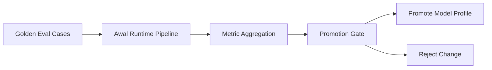

# Evaluation Strategy

## Purpose

This document defines how Awal should prove that it works.

The system should be judged by grounded behavior, not by how polished the answer sounds.

## Core evaluation goals

Awal should measure:

- `grounded accuracy`
- `citation correctness`
- `refusal precision`
- `refusal recall`
- `conflict handling`
- `retrieval quality`
- `latency`
- `cost per answer`

## Evaluation layers

The system should be evaluated in layers rather than as one opaque box.

### 1. Ingestion evaluation

Questions:

- did Docling extract the right text and structure?
- did OCR-heavy files remain usable?

Metrics:

- extraction success rate
- parse coverage
- OCR review flags

### 2. Chunking evaluation

Questions:

- do chunks preserve section meaning?
- are tables and structural blocks split sensibly?

Metrics:

- chunk coherence
- section alignment
- span recoverability

### 3. Retrieval evaluation

Questions:

- is the right chunk present in top-k?
- is reranking actually improving evidence quality?

Metrics:

- hit@k
- recall@k
- MRR
- rerank lift

### 4. Generation evaluation

Questions:

- given correct evidence, does the model answer correctly?
- does it stay within the evidence boundary?

Metrics:

- grounded answer correctness
- unsupported-claim rate
- citation-use correctness

### 5. Runtime policy evaluation

Questions:

- does the system refuse when support is weak?
- does it surface conflicts instead of inventing a merge?

Metrics:

- refusal precision
- refusal recall
- conflict-detection rate

## Golden test set

Awal should maintain a versioned regression suite with cases in these categories:

- answer found in one passage
- answer synthesized from a few passages
- answer not present in corpus
- outside-knowledge trap question
- conflicting documents
- OCR-noisy source
- table-based answer
- revision-sensitive answer

Each test case should include:

- input documents
- collection scope
- question
- expected answer state
- expected answer points
- acceptable citations

## Promotion gates

A new model profile should not be promoted unless it:

- maintains or improves grounded accuracy
- does not materially regress refusal precision
- does not increase unsupported-claim rate
- stays within acceptable latency and cost

## Runtime safeguards

The live system should also enforce:

- minimum retrieval threshold
- minimum rerank threshold
- required citations
- refusal fallback on invalid structured output
- logging of evidence ids selected

## Diagram

