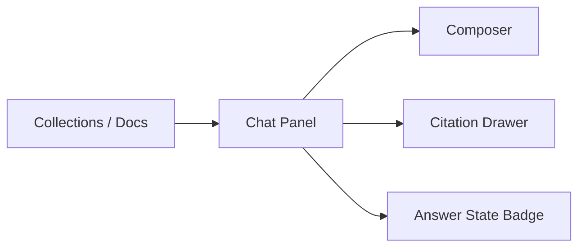

# Frontend

## Purpose

The frontend for Awal should be intentionally standard.

This is not the place to invent complexity. The value is in the retrieval and runtime discipline, not in an unusual UI.

## Initial product shape

### Public user surface

- standard chat layout
- left panel for document collections
- main panel for chat messages
- evidence drawer for citations

### Admin or owner surface

- upload documents
- see ingestion status
- manage collections
- review recent conversations

## Main screens

### 1. Chat screen

Elements:

- message list
- composer
- current collection selector
- citation panel
- answer status badge

### 2. Documents screen

Elements:

- document list
- upload button
- revision status
- chunking/index readiness indicators

### 3. Conversation detail

Elements:

- question
- grounded answer or refusal
- cited spans
- retrieval trace summary for internal/admin mode

## UX rules

- always show whether an answer is grounded or refused
- make citations visible without cluttering the main chat stream
- do not present unsupported answers with confident styling
- show ingestion pending states clearly

## Answer presentation

### Grounded answer

- answer body
- linked citations
- document title and location metadata

### Insufficient evidence

- explicit refusal
- optional note saying the answer is not in the provided documents

### Conflict detected

- short comparison view
- two or more cited passages
- no forced merged answer

## Frontend architecture

The frontend can remain simple:

- React or Next.js standard app
- no unusual state model required for v1
- server-driven data fetching is acceptable

## Minimal UI diagram

