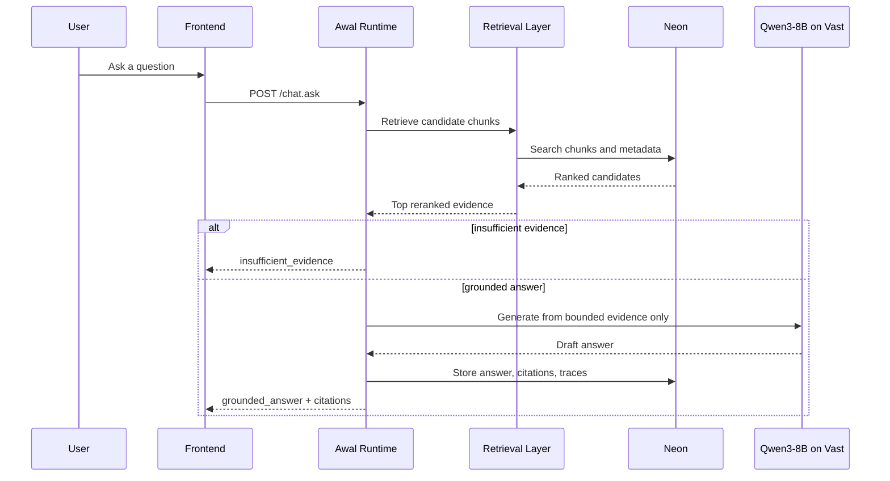
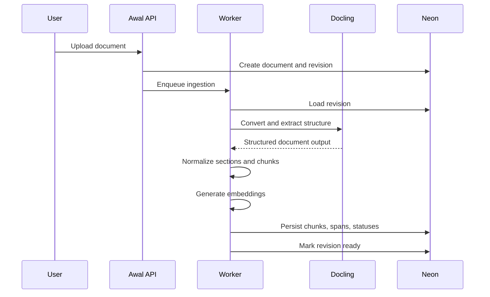

# Runtime Flows

## Purpose

This document defines the major runtime flows for Awal.

## Flow 1: Document ingestion

Goal:

- accept a document
- validate type and ownership boundary
- extract text and structure
- create retrieval units
- persist evidence-bearing records

### Steps

1. user uploads a document into a workspace and collection
2. API creates `Document` and `DocumentRevision`
3. worker validates file type and checksum
4. worker extracts text and structural sections
5. worker creates chunks
6. worker generates embeddings
7. worker stores searchable records
8. worker marks revision as `ready`

### Failure rules

- invalid files are rejected explicitly
- partial ingest leaves revision visible as failed, not silently missing
- prior good revisions remain valid if a new revision fails

## Flow 2: Question answering

Goal:

- answer only from document evidence

### Steps

1. user sends question to chat endpoint
2. runtime validates workspace and collection scope
3. runtime normalizes the query
4. retrieval layer runs hybrid retrieval
5. reranker scores top candidates
6. runtime checks evidence threshold
7. if threshold fails, return `insufficient_evidence`
8. if threshold passes, runtime builds bounded evidence prompt
9. runtime calls model on Vast.ai
10. runtime validates answer structure and citations
11. runtime stores answer record and retrieval trace
12. runtime returns grounded answer

## Flow 3: Refusal

Goal:

- refuse instead of hallucinating

### Refusal triggers

- no high-confidence chunks found
- retrieved chunks do not answer the question
- question asks for information outside the corpus
- user requests unsupported extrapolation

### Refusal response behavior

- say the answer cannot be determined from the provided documents
- optionally cite near-matches or related sections
- do not improvise from general knowledge

## Flow 4: Conflict handling

Goal:

- surface disagreement rather than merging contradictory evidence

### Steps

1. retrieval finds strong support from multiple conflicting passages
2. runtime detects material contradiction
3. runtime sets answer state to `conflict_detected`
4. response presents competing citations
5. system avoids synthetic reconciliation unless documents explicitly justify it

## Flow 5: Reindex or revision update

Goal:

- safely update a document without corrupting retrieval history

### Steps

1. new file uploaded against existing document identity
2. system creates a new `DocumentRevision`
3. worker re-runs extraction and chunking
4. prior revision remains queryable until new one is marked ready
5. latest ready revision becomes active

## Chat answer flow diagram

## Ingestion flow diagram

## Prompt contract for answer generation

The runtime should construct prompts with:

- the user question
- retrieved evidence blocks only
- citation ids for each block
- explicit instructions to refuse unsupported answers

The runtime should not pass:

- unrelated chat history unless needed
- external world knowledge
- hidden instructions encouraging best-effort completion

## Validation rules after generation

The runtime should reject or downgrade outputs that:

- make claims without usable citations
- refer to evidence ids not provided
- answer outside the corpus
- merge contradictory evidence without disclosure
